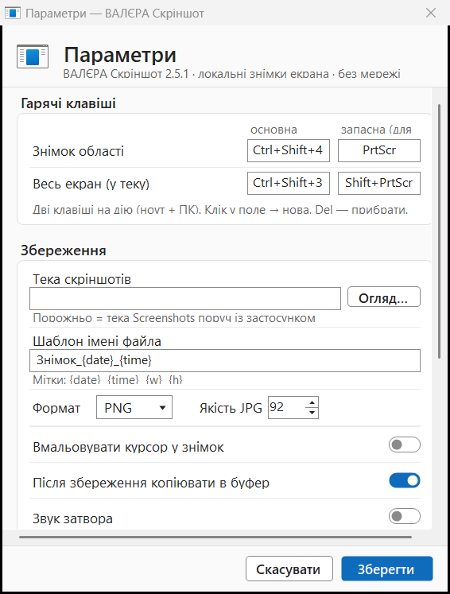
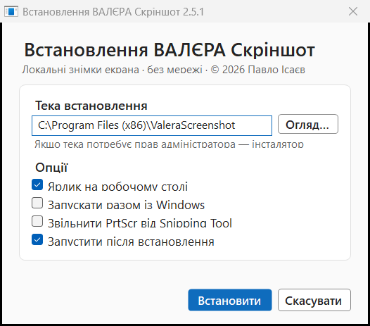

<p align="center"></p>

# ВАЛЄРА Скріншот — локальні знімки екрана

[](https://github.com/nsrosbr/valera-screenshot/actions/workflows/gate.yml)
[](https://github.com/nsrosbr/valera-screenshot/releases/latest)
[](LICENSE)


*[English README](README_EN.md)*

Повноцінний аналог **Lightshot** для Windows — але повністю **локальний**: без мережі,
без хмари prnt.sc, без телеметрії. Інтерфейс у стилі **Microsoft Office (Fluent)**.

| Світла тема | Темна тема |
|---|---|
|  |  |
|  |  |
|  |  |

<sub>Ці знімки не намальовані вручну: їх щоразу перезнімає `tools/ProofGate.exe`, він же
міряє на них контраст за WCAG і належність кожного кольору до чинної палітри. Якщо тема
зламається, зламається і збірка.</sub>

Написаний на C# і збирається **компілятором, який уже вбудований у Windows** (`.NET Framework 4.x`) —
не потрібні ані Visual Studio, ані .NET SDK, ані NuGet. Нуль залежностей, один `.exe` (~90 КБ).

**Автор:** Павло Ісаєв · © 2026 · **версія 2.5.1** · [caussa.blog](https://caussa.blog)
(авторство вшито в метадані `.exe`: Властивості → Подробиці; підпис — самопідписаний
сертифікат автора, див. [SECURITY.md](SECURITY.md)).

**Пакети й версії:** [GitHub Releases](https://github.com/nsrosbr/valera-screenshot/releases/latest) —
`ValeraScreenshotSetup_v<ver>.exe` (інсталятор, тихий режим `/S`) і голий підписаний
`ValeraScreenshot.exe` (саме його тягне вбудований оновлювач);
журнал змін — [CHANGELOG.md](CHANGELOG.md). Мануал користувача — **MANUAL.txt**.

## Мова

Українська та англійська. За замовчуванням — **як у Windows**; вибір є в Параметрах і
застосовується **без перезапуску**. Перекладено весь інтерфейс, включно з інсталятором,
деінсталятором і повідомленнями про помилки.

Назви мов у списку показані самими цими мовами («Українська», «English») — так, як це
робить сама Windows: людина мусить упізнати свою мову, не читаючи чужої.

## Доступність

Не як галочка, а як вимірюваний критерій — усе нижче перевіряє гейт при кожній збірці:

- **Тема** світла / темна / «Як у Windows», з реакцією на зміну теми системи **без перезапуску**.
- **Висока контрастність Windows** переважає будь-який вибір теми: палітра береться з
  `SystemColors`, бо саме ці кольори користувач і оголосив тими, якими здатен читати екран.
  Пруф-гейт сканує кадр і червоніє, якщо в ньому лишився хоч наш фірмовий синій.
- **Контраст за WCAG 2.1**: 4.5:1 для тексту, 3:1 для межі полів і кнопок — міряється в
  пікселях реального вікна, а не декларується.
- **Екранний диктор**: кожен фокусований контрол має імʼя; перемикачі оголошують ще й стан
  (увімкнено/вимкнено) і дію.
- **Клавіатура**: діалоги проходяться Tab, `Space` перемикає тумблер, `Enter` зберігає,
  `Esc` скасовує; фокус видимий — поле вводу підсвічує рамку акцентом.

---

## Аналіз Lightshot → що реалізовано

| Lightshot | ValeraScreenshot |
|---|---|
| **PrtScr** → екран «замерзає», тягнеш область | так, **дві клавіші на дію (ноут+ПК)**: основна `Ctrl+Shift+4` (є на будь-якій клавіатурі) + запасна `PrtScr` (звична на ПК), обидві активні й налаштовні; клік без тяги = увесь монітор; `Ctrl+A` = все |
| Точне виділення | так + **лупа** з піпеткою (координати, HEX-колір), бейдж розміру W×H, 8 маркерів зміни розміру, переміщення мишею і стрілками (`Shift` = ×10) |
| Інструменти: олівець, лінія, стрілка, рамка, маркер, текст, колір, скасувати | так, усі + **еліпс**, **мозаїка** (пікселізація), **нумеровані кроки 1-2-3**, **підсвітка зони**, **чорна заливка** (незворотне приховання) — 13 інструментів; **повернути** (Ctrl+Y); товщина кнопкою або **коліщатком миші** |
| — (у Lightshot немає) | **Маршрут (G):** будуй шлях по карті кліками (точка→лінія→точка→…), 2 кліки завершують; зелений старт, вузли, стрілка в кінці, лупа для точності. Знімком зі шляхом одразу ділишся |
| Поділитися | **краще за Lightshot:** локальне вікно «Поділитися» (Ctrl+D) підхоплює встановлені WhatsApp/Telegram/Viber/Signal (знімок у буфері — Ctrl+V у чат) і пошту **з файлом у вкладенні** (MAPI); нічого не йде на чужі сервери |
| Копіювати в буфер | так: `Enter`, `Ctrl+C`, подвійний клік (у буфер кладеться і DIB, і PNG) |
| Зберегти у файл | так: `Ctrl+S` — миттєво в теку за шаблоном; `Ctrl+Shift+S` — діалог «Зберегти як» (PNG/JPG) |
| Друк | так: `Ctrl+P` |
| Знімок усього екрана | так: **`Ctrl+Shift+3`** (бонусом і `Shift+PrtScr`) — одразу файл у теку (+буфер) |
| Іконка в треї, налаштування, автозапуск | так: трей-меню, вікно параметрів у стилі Windows 11, автозапуск-перемикач |
| **Завантаження на prnt.sc, соцмережі, «шукати схожі»** | **свідомо НЕМАЄ.** Знімки не залишають машину: у коді немає жодного шляху, що відсилає зображення. Мережа працює РІВНО в одному місці — `src\Updater.cs` іде на GitHub Releases по маніфест оновлення, і лише коли ви самі тиснете «Перевірити оновлення…». Хмарний аплоад Lightshot — це публічні URL, які індексуються; для нашої роботи це неприйнятно |
| Роздільність знімка | **вища за Lightshot:** маніфест PerMonitorV2 + `BitBlt(CAPTUREBLT)` → 1:1 **фізичні** пікселі на будь-якому DPI-масштабі, всі монітори (віртуальний екран). Доведено тестом: 2560×1440 |

**Гарячі клавіші оверлея:** `V/P/L/A/R/E/F/I/N/G/M/T/B` — інструменти (вибір/олівець/лінія/стрілка/рамка/еліпс/підсвітка/мозаїка/крок/маршрут/маркер/текст/заливка),
`Ctrl+Z`·`Ctrl+Y` — скасувати/повернути, `Ctrl+D` — поділитися, `Esc` — вийти, права кнопка — зняти виділення / вийти.

---

## Запуск і встановлення

**Інсталятор (рекомендовано):** [`ValeraScreenshotSetup_v2.5.1.exe`](https://github.com/nsrosbr/valera-screenshot/releases/latest) —
майстер встановлення, дефолтна тека `C:\Program Files (x86)\ValeraScreenshot` (сам запитає
підняття прав UAC; без адмінправ чесно запропонує `%LOCALAPPDATA%\Programs\ValeraScreenshot`).
Опції: ярлик на столі, автозапуск, звільнення PrtScr. Тихо: `Setup.exe /S [/D=тека]
[/autostart] [/desktop] [/freeprtscr]`. Оновлення — з трея: «Перевірити оновлення…».

**Видалення:** «Програми» → ValeraScreenshot → Видалити (це `Uninstall.exe` з теки встановлення).
Тека `Screenshots\` з вашими знімками **ніколи не видаляється**.

**Гарячі клавіші стійкі до заліза:** основні `Ctrl+Shift+4/3` не залежать від наявності
PrtScr; якщо PrtScr є, але його тримає Snipping Tool — бонус-реєстрація просто мовчки
не спрацює (основні клавіші працюють завжди), а кнопка «Звільнити PrtScr» у Параметрах
вимикає системне перехоплення.

Налаштування — `settings.ini` поруч з exe (портативно). Скріншоти за замовчуванням —
`Screenshots\` поруч з exe; тека, шаблон імені (`{date} {time} {w} {h}`), PNG/JPG і якість —
у Параметрах.

---

## Збірка з коду і контроль якості

```powershell
powershell -ExecutionPolicy Bypass -File .\build.ps1        # ValeraScreenshot.exe
powershell -ExecutionPolicy Bypass -File .\test.ps1         # ПОВНИЙ гейт (збірка + усі шари нижче)
.\tests\Test.exe        # ядро: 65 тверджень + матриці privacy/updater/lifecycle + корпус
.\tools\ProofGate.exe   # візуальні пруфи: знімає з екрана і МІРЯЄ (контраст WCAG, тема, заголовок)
.\tools\Drive.exe       # живий прогін: керує справжнім застосунком справжнім вводом
.\tools\FieldProbe.exe  # симетрія встановлення/видалення, машину лишає як знайшов
.\tools\mutate.ps1      # мутаційне тестування самого гейта
.\ValeraScreenshot.exe --capture-full [--out шлях.png]   # безголовий знімок екрана (для скриптів)
.\sign.ps1              # Authenticode-підпис (після кожної збірки)
```
**Чи займають тести екран.** Ні, крім одного шару. `ProofGate` створює вікна ПОЗА видимою
областю й просить їх намалювати себе (`PrintWindow`) — нічого не піднімається поверх вашої
роботи, курсор не рухається. `Drive` — єдиний виняток і інакше не може: глобальні гарячі
клавіші спрацьовують лише на ввід у поточний робочий стіл, тож він на ~90 секунд забирає
екран. Запускайте його, коли машина вільна.

Саме тому `Drive` **не запускається сам**: його вмикають явно — `.\verify.ps1 -WithDrive`
або `VALERASCREENSHOT_RUN_DRIVE=1`. Раніше було навпаки (запускався завжди, вимикався змінною),
і це клало «не забирати чужий екран» на чиюсь пам'ять замість на замовчування.
`VALERASCREENSHOT_SKIP_PROOF=1` вимикає й візуальний шар — для машини без сесії робочого стола
(напр. CI). Обидва **друкують** свій скіп: критерій, що зникає тихо, не критерій.
`/codepage:65001` у build.ps1 обов'язковий — у коді кириличні літерали.

## Чесні обмеження

- Голий `PrtScr` (без модифікаторів) — особливий системний ключ: Windows допускає його
  паралельну реєстрацію кількома програмами, тож ексклюзив не гарантований (квірк ОС).
  Основні `Ctrl+Shift+4/3` і `Shift+PrtScr` — ексклюзивні (перевірено зовнішнім зондом).
  Статус реєстрації всіх клавіш застосунок пише у `_hotkeys.txt` при кожному запуску.
- Анотації малюються лише в межах виділення (як у Lightshot); окремого «редактора після» немає.
- Скасування (`Ctrl+Z`) і повернення (`Ctrl+Y` або `Ctrl+Shift+Z`) діють у межах поточного знімка;
  після виходу з оверлея історія не зберігається.
- «Заливка» — суцільний чорний прямокутник: це **надійне** приховання (розмиття відновлюване, тому його свідомо немає).
- У вікнах, запущених від адміністратора, гарячі клавіші діятимуть, але діалоги поверх них можуть не отримати фокус (UIPI).
- Поки самопідписаний сертифікат автора не в довірених сховищах, підпис показується як
  недовірений, а SmartScreen попереджає при першому завантаженні. Це не робить бінарник
  безпечнішим чи небезпечнішим — лише означає, що за нього не поручився платний посередник.
  Штатний шлях довіри й відбиток — у [SECURITY.md](SECURITY.md).
- Системні діалоги (`MessageBox`) лишаються світлими в темній темі — так поводяться і власні
  застосунки Windows; власного рендеру системних вікон немає ні в кого.

## Структура

```
src\Native.cs        — Win32 interop (BitBlt/CAPTUREBLT, RegisterHotKey, курсор, DPI)
src\Capture.cs       — двигун захоплення (ScreenCap): віртуальний екран 1:1, PNG/JPEG
src\Annotate.cs      — модель анотацій (олівець/лінія/стрілка/рамка/еліпс/маркер/текст/заливка)
src\OverlayForm.cs   — оверлей: виділення, лупа, тулбар, палітра, дії (копія/файл/друк)
src\Config.cs        — settings.ini поруч з exe (портативно), шаблон імені файла
src\App.cs           — трей, глобальні хоткеї (+відступ при зайнятому PrtScr), --capture-full
src\SettingsForm.cs  — параметри (стиль Windows 11: картки + toggle), захоплення хоткеїв
src\AboutForm.cs     — «Про програму» · src\Ui.cs — тема, діалоги, мальовані контроли
tests\TestMain.cs    — ядро (65 тверджень) + матриці приватності/оновлень/життєвого циклу
tools\ProofGate.cs   — ВІЗУАЛЬНИЙ гейт: знімає кожну поверхню з екрана в обох темах і МІРЯЄ
                       (контраст WCAG 4.5:1, належність тла до палітри, заголовок, light≠dark)
tools\Drive.cs       — ЖИВИЙ прогін: запускає застосунок і керує ним справжнім вводом
                       (миша+клавіатура), звіряє результат по пікселях; входить у гейт
tools\FieldProbe.cs  — симетрія встановлення/видалення + «машину лишено як знайшли»
tools\MakeIcon.cs    — генератор app.ico · app.manifest — PerMonitorV2 DPI
build.ps1 / sign.ps1 / install.ps1 / uninstall.ps1 / INSTALL.bat / UNINSTALL.bat
```

## Підтримати проєкт · Support

Проєкт **вільний і таким залишиться**. Якщо ВАЛЄРА Скріншот став вам у пригоді й ви хочете
підтримати розробку якісного ПЗ:

[](https://ko-fi.com/pavloisaiev)
[](https://send.monobank.ua/jar/52FQ1MSqEK)
