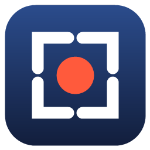
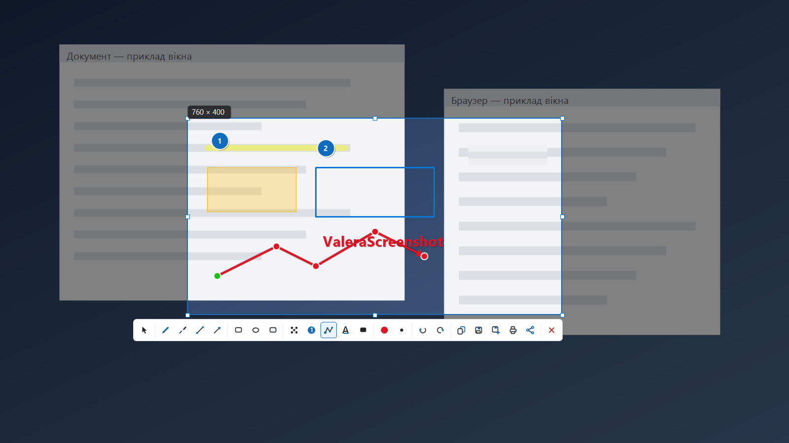
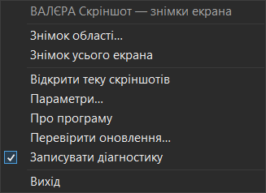
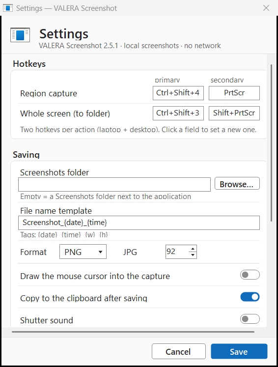
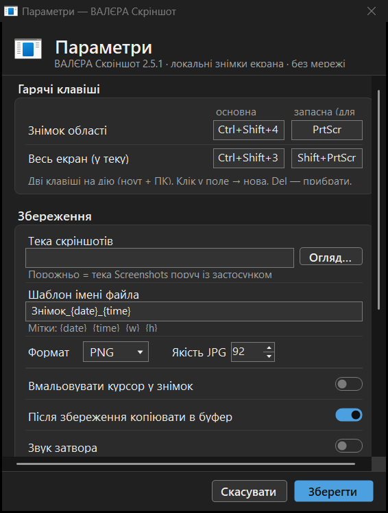
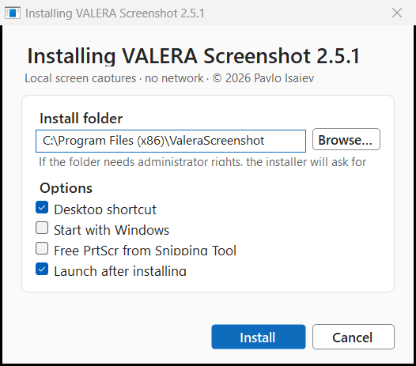
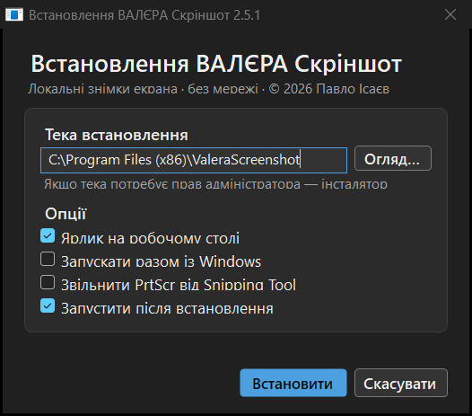

<p align="center"></p>

# VALERA Screenshot — local screen captures

[](https://github.com/nsrosbr/valera-screenshot/actions/workflows/gate.yml)
[](https://github.com/nsrosbr/valera-screenshot/releases/latest)
[](LICENSE)


*[Українською](README.md)*

A full Lightshot equivalent for Windows — but entirely **local**: no network, no prnt.sc cloud,
no telemetry. Interface in the Microsoft Office (Fluent) style. Interface language: Ukrainian
or English, following Windows by default.

Written in C# and built with the compiler **already inside Windows** (`.NET Framework 4.x`) —
no Visual Studio, no .NET SDK, no NuGet. Zero dependencies, one `.exe`.

**Author:** Pavlo Isaiev · © 2026 · **version 2.5.1** · [caussa.blog](https://caussa.blog)

| Light theme (English UI) | Dark theme |
|---|---|
|  |  |
|  |  |
|  |  |

<sub>These shots are not hand-made: `tools/ProofGate.exe` re-captures them on every run and
measures WCAG contrast and palette membership on them. If the theme breaks, the build breaks.
The right-hand column carries the Ukrainian UI on purpose: the English proofs are captured in the
light theme, because that axis measures string LENGTH (English labels are longer and overflow
first), while the dark axis measures colour. Both run on every build; neither is a mock-up.</sub>

## What it does

| Lightshot | ValeraScreenshot |
|---|---|
| **PrtScr** freezes the screen, you drag a region | Yes, and **two hotkeys per action** (laptop + desktop): primary `Ctrl+Shift+4` (present on any keyboard) plus a secondary `PrtScr`; both live and configurable. A click without dragging takes the whole monitor; `Ctrl+A` takes everything |
| Precise selection | Yes, plus a **magnifier** with an eyedropper (coordinates, HEX colour), a W×H size badge, 8 resize handles, and movement by mouse or arrow keys (`Shift` = ×10) |
| Tools: pencil, line, arrow, rectangle, highlighter, text, colour, undo | All of them, plus **ellipse**, **mosaic** (pixelation), **numbered steps 1-2-3**, **area highlight**, **solid black redaction** — 13 tools; **redo** (Ctrl+Y); thickness by button or **mouse wheel** |
| — (not in Lightshot) | **Route (G):** build a path over a map by clicking (point → line → point → …), double-click finishes. Green start, nodes, arrow at the end, magnifier for precision |
| Share | **Better than Lightshot:** a local Share dialog (Ctrl+D) picks up installed WhatsApp / Telegram / Viber / Signal (the capture is already on the clipboard — Ctrl+V into the chat) and email **with the file attached** (MAPI). Nothing goes to anyone else's servers |
| Copy to clipboard | Yes: `Enter`, `Ctrl+C`, double-click (both DIB and PNG are placed on the clipboard) |
| Save to a file | Yes: `Ctrl+S` saves straight into the folder using a template; `Ctrl+Shift+S` opens Save As (PNG/JPG) |
| Print | Yes: `Ctrl+P` |
| Whole-screen capture | Yes: **`Ctrl+Shift+3`** (and `Shift+PrtScr`) — straight to a file (and the clipboard) |
| Tray icon, settings, autostart | Yes: tray menu, a Windows 11 style settings window, an autostart switch |
| **Upload to prnt.sc, social networks, "find similar"** | **Deliberately absent.** Captures never leave the machine: there is no code path that sends an image anywhere. The network is used in exactly one place — `src/Updater.cs` fetches an update manifest from GitHub Releases, and only when you press "Check for updates". Lightshot's cloud upload produces public URLs that get indexed |
| Capture resolution | **Higher than Lightshot:** a PerMonitorV2 manifest plus `BitBlt(CAPTUREBLT)` gives 1:1 **physical** pixels at any DPI scale, across all monitors (the virtual screen). Proven by test at 2560×1440 |

**Overlay hotkeys:** `V/P/L/A/R/E/F/I/N/G/M/T/B` select tools (select / pencil / line / arrow /
rectangle / ellipse / highlight / mosaic / step / route / marker / text / redact);
`Ctrl+Z` · `Ctrl+Y` undo/redo, `Ctrl+D` share, `Esc` exit, right-click clears the selection or exits.

## Install

**Installer (recommended):** `ValeraScreenshot-Setup-<ver>.exe` — a wizard, default folder
`C:\Program Files (x86)\ValeraScreenshot` (it asks for UAC elevation; without admin rights it honestly
offers `%LOCALAPPDATA%\Programs\ValeraScreenshot`). Options: desktop shortcut, autostart, free up PrtScr.
Silent: `Setup.exe /S [/D=folder] [/autostart] [/desktop] [/freeprtscr]`.

**Uninstall:** Apps → ValeraScreenshot → Uninstall. Your `Screenshots\` folder is **never** deleted.

Settings live in `settings.ini` next to the exe. Screenshots go to `Screenshots\`
next to the app by default; folder, name template (`{date} {time} {w} {h}`), PNG/JPG and quality
are all in Settings.

## Language

Ukrainian and English. The default follows Windows; the choice is in Settings and applies
**without a restart**. Everything is translated, including the installer, the uninstaller and
the error messages.

Language names in the list are shown in their own language ("Українська", "English") — the way
Windows itself does it: you have to recognise your language without first reading a foreign one.

## Accessibility

Not a checkbox but a measured criterion — the gate verifies all of this on every build:

- **Theme** light / dark / "as in Windows", reacting to a Windows theme change **without a restart**.
- **Windows High Contrast** overrides any theme choice: the palette comes from `SystemColors`,
  because those are the colours the user declared they can read. The proof gate scans the frame
  and turns red if our brand colour survives anywhere in it.
- **WCAG 2.1 contrast**: 4.5:1 for text, 3:1 for the borders of fields and buttons — measured in
  the pixels of a real window, not declared.
- **Narrator**: every focusable control has a name; switches also announce their state and action.
- **Keyboard**: dialogs are fully reachable by Tab, `Space` toggles a switch, `Enter` saves,
  `Esc` cancels; focus is visible — a text field highlights its border with the accent colour.

## Building and quality control

```powershell
powershell -ExecutionPolicy Bypass -File .\build.ps1        # ValeraScreenshot.exe
powershell -ExecutionPolicy Bypass -File .\test.ps1         # THE gate (build + every layer below)
.\tests\Test.exe        # core: 93 assertions + privacy/updater/lifecycle/accessibility matrices
.\tools\ProofGate.exe   # visual proofs: captures and MEASURES (WCAG contrast, theme, title bar)
.\tools\Drive.exe       # live run: drives the real app with real input
.\tools\FieldProbe.exe  # install/uninstall symmetry; leaves the machine as it found it
.\tools\mutate.ps1      # mutation testing of the gate itself
```

**Do the tests take over the screen?** No, except one layer. `ProofGate` creates windows *off*
the visible area and asks them to draw themselves (`PrintWindow`) — nothing is raised over your
work and the cursor is not moved. `Drive` is the single exception and cannot be otherwise:
global hotkeys only fire for input injected into the current desktop, so it owns the screen for
about 90 seconds. Run it when the machine is free.

Which is why `Drive` **does not run on its own**: you ask for it explicitly, with
`.\verify.ps1 -WithDrive` or `VALERASCREENSHOT_RUN_DRIVE=1`. It used to be the other way round
(always on, a variable to turn it off), which put "do not seize someone's desktop" on memory
instead of on the default. `VALERASCREENSHOT_SKIP_PROOF=1` also turns off the visual layer, for a
machine with no desktop session (e.g. CI). Both **print** their skip — a criterion that can vanish
silently is not a criterion.

## Honest limits

- A bare `PrtScr` (no modifiers) is a special system key: Windows allows several programs to
  register it in parallel, so exclusivity is not guaranteed. The primary `Ctrl+Shift+4/3` and
  `Shift+PrtScr` are exclusive. The registration status of every hotkey is written to
  `_hotkeys.txt` on each start.
- Annotations are drawn inside the selection only (as in Lightshot); there is no separate
  after-the-fact editor.
- Undo/redo are scoped to the current capture; history is not kept after leaving the overlay.
- "Redact" is a solid black rectangle: that is **reliable** concealment. Blur is reversible,
  which is why it is deliberately absent.
- In windows running as administrator the hotkeys still fire, but dialogs on top of them may not
  receive focus (UIPI).
- The signing certificate is **self-signed**, so SmartScreen warns on first download. This does
  not make the binary safer or less safe — it only means no paid intermediary vouched for it.
  See [SECURITY.md](SECURITY.md) for the fingerprint and the trust flow.
- System dialogs (`MessageBox`) stay light in the dark theme — Windows' own applications behave
  the same way; nobody renders system windows themselves.

## Licence

MIT — see [LICENSE](LICENSE).

## Support the project

The project is **free and will stay free**. If VALERA Screenshot serves you well:

[](https://ko-fi.com/pavloisaiev)
[](https://send.monobank.ua/jar/52FQ1MSqEK)
